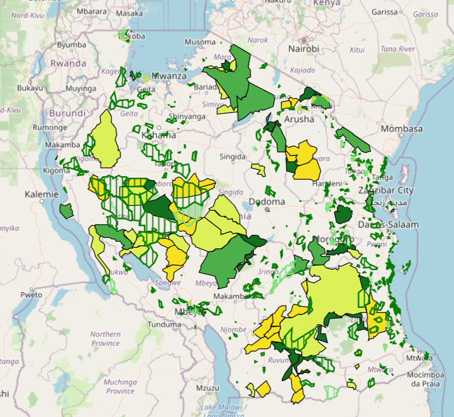

#Web map practical Emil Taskinen
A practical demo of developing interactive web maps in qgis2web plugin and editing them in visual studio using practical full examples. part of course practicals 
Map depicts Tanzanian forest reserves and national parks dated (2020|2016).

Can be found and reviewed here: <https://et-task.github.io/Webmap_Emil/#6/-6.392/35.024>
